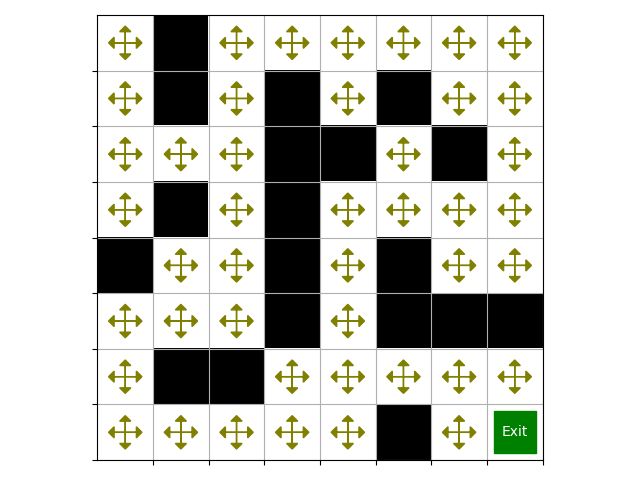
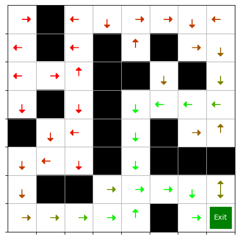

### Escape from a maze using reinforcement learning

##### Solving an optimization problem using an MDP and TD learning

The environment for this problem is a maze with walls and a single exit. An agent (the learner and decision maker) is placed somewhere in the maze. The agents' goal is to reach the exit as quickly as possible. To get there the agent moves through the maze in a succession of steps. For every step the agent must decide which action to take. The options are move left, right, up or down. For this purpose the agent is trained; it learns a policy (Q) which tells what is the best next move to make. With every step the agent incurs a penalty or - when finally reaching the exit - a reward. These penalties and rewards are the input when training the policy. 



The values for the penalties and rewards are defined in class *Maze* in *maze.py*:
```python
    reward_exit = 10.0  # reward for reaching the exit cell
    penalty_move = -0.05  # penalty for a move which did not result in finding the exit cell
    penalty_visited = -0.25  # penalty for returning to a cell which was visited earlier
    penalty_impossible_move = -0.75  # penalty for trying to enter an occupied cell or moving out of the maze
```
The policies (or models) used here are based on Sarsa and Q-learning. During training the learning algorithm updates the action-value function Q for each state which is visited. The most preferable action is indicated by the highest value. Updating these values is based on the reward or penalty incurred after the action was taken. With TD-learning a model learns at every step it takes, not only when the exit is reached. However, learning does speed up once the exit has been reached for the first time. 

This project demonstrates different models which learn to move through a maze. Class Maze in file *maze.py* in package *environment* defines the environment including the rules of the game (rewards, penalties). In file *RL_maze.ipynb* an example of a maze is defined as a np.array. When training or playing the agents moves can be plotted by calling Maze.render(Render.MOVES). To also display the progress of training call Maze.render(Render.TRAINING). This visualizes the most preferred action per cell. The higher the value the greener the arrow is displayed.



Package *models* contains the following models:
1. *QTableModel* uses a table to record the value of each (state, action) pair. For a state the highest value indicates the most desirable action. These values are constantly refined during training. This is a fast way to learn a policy.
2. *SarsaTableModel* uses a similar setup as the previous model, but takes less risk during learning (= on-policy learning).
3. *QTableTraceModel* is an extension of the QTableModel. It speeds up learning by keeping track of previously visited state-action pairs, and updates their values as well although with a decaying rate.
4. *SarsaTableTraceModel* is a variant of SarsaTableModel but adds an eligibility trace, just as QTableTraceModel.

The table below gives an impression of the relative performance of each of these models (on my PC):

| Model | Trained | Average no of episodes | Average training time |
| --- | --- |------------------------|-----------------------| 
| QTableModel | 10 times | 160                    | 4.9 sec               |
| QTableTraceModel | 10 times | 80.0                   | 1.1 sec               |
| SarsaTableModel | 10 times | 132.0                  | 4.1 sec               |
| SarsaTableTraceModel | 10 times | 89.0                   | 1.4 sec               |

Requires matplotlib, numpy, keras and tensorflow.

The training Matrices are as follows:-

